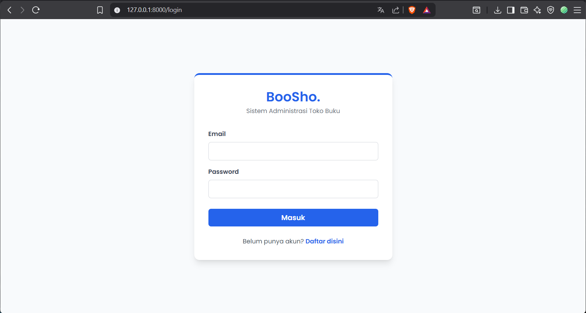
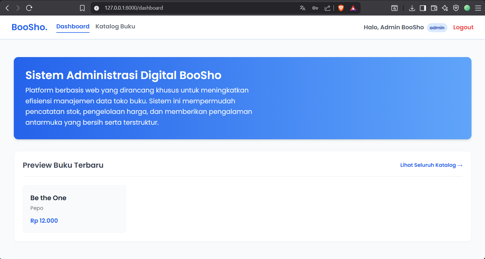
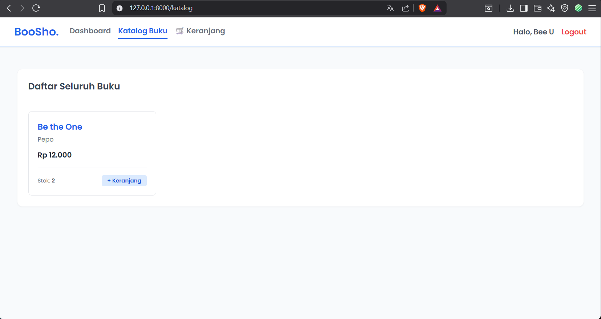
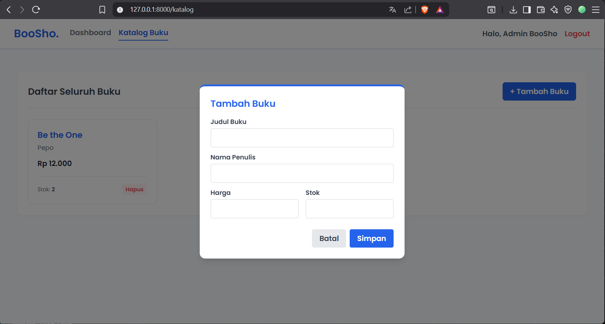
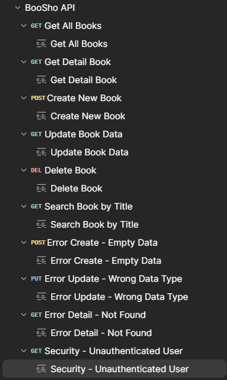

# Web Toko Buku BooSho

BooSho adalah platform toko buku digital berbasis web yang dikembangkan menggunakan framework Laravel 11. Proyek ini dibangun untuk memenuhi standar arsitektur perangkat lunak yang memisahkan hak akses pengguna (Role-Based Access Control) dan menyediakan jalur RESTful API yang terdokumentasi dengan rapi.

---

## 1. Identitas Developer
* Nama  : Reza Fairul Nizam
* NIM   : 2305101022

## 2. Deskripsi & Fitur Aplikasi
Aplikasi ini membagi sistem menjadi dua antarmuka dan hak akses utama:
* Fitur Admin: Dapat mengakses antarmuka *Dashboard* untuk melihat pratinjau data, serta halaman *Katalog* untuk melakukan operasi CRUD (Create, Read, Update, Delete) pada data buku secara langsung melalui UI Web.
* Fitur User: Dapat mendaftar akun baru, *login*, melihat pratinjau buku, memasukkan buku ke dalam Keranjang Belanja, dan melakukan *Checkout* yang akan memotong stok buku di database secara otomatis.
* Fitur API: Menyediakan 6 *endpoint* RESTful API utama (termasuk fitur pencarian *Search*) yang telah melewati 10 skenario pengujian, baik skenario sukses (*Positive Testing*) maupun skenario validasi *error* (*Negative Testing*).
* UI/UX: Antarmuka dibangun dengan tampilan bersih menggunakan Tailwind CSS dan dilengkapi notifikasi *pop-up* interaktif dari SweetAlert2.

## 3. Dokumentasi Visual (Screenshot & ERD)
Berikut adalah tangkapan layar dari rancangan database, antarmuka aplikasi web, dan pengujian API yang telah dilakukan:

### Database Design (ERD)


### Tampilan Web Aplikasi





### Daftar Endpoint API (Postman)
Berikut adalah 10 skenario pengujian API yang telah disusun dan diuji melalui Postman:
### Daftar Endpoint API

| Modul | Method | Endpoint (Route) | Deskripsi & Akses |
| :--- | :--- | :--- | :--- |
| **Buku** | GET | `/api/books` | Menampilkan semua data buku di katalog |
| | GET | `/api/books/{id}` | Menampilkan detail data buku berdasarkan id |
| | POST | `/api/books` | Menambahkan data buku baru ke katalog |
| | PUT | `/api/books/{id}` | Update data spesifik buku berdasarkan id |
| | DELETE | `/api/books/{id}` | Hapus data buku berdasarkan id |
| | GET | `/api/books/search/{title}`| Melakukan pencarian buku berdasarkan judul |
| **User** | GET | `/api/user` | Mendapatkan data profil user yang sedang login |


*(Catatan tambahan: File asli hasil Export Collection JSON dari Postman dilampirkan secara lengkap di dalam folder `documentation/Postman API/BooSho API.postman_collection.json` pada repository ini).*

---

## 4. Struktur Folder & Database Migrate
Sistem ini menggunakan struktur standar Laravel dengan pengorganisasian dokumen pendukung sebagai berikut:
* File rute logika web UI berada di `routes/web.php`.
* File rute *backend API* berada di `routes/api.php`.
* Pengendali utama berada di `app/Http/Controllers/AuthController.php` dan `app/Http/Controllers/Api/BookController.php`.
* Seluruh *file* tampilan web (`.blade.php`) berada di direktori `resources/views/`.
* Seluruh berkas dokumentasi (Screenshot, ERD, dan Postman JSON) diletakkan rapi pada sub-folder di dalam direktori `documentation/`.

### Status Database (Migration Tersedia)
Database proyek ini sudah terintegrasi penuh menggunakan sistem *Migration* dari Laravel. File migrasi tabel (`users`, `books`, `carts`) tersedia lengkap di dalam direktori `database/migrations/`.

**Cara Melakukan Setup Database:**
1. Salin `env.example` menjadi `.env` dan konfigurasikan nama database MySQL Anda.
2. Jalankan perintah ini di terminal untuk mengeksekusi migrasi dan membuat tabel secara otomatis:
   ```bash
   php artisan migrate